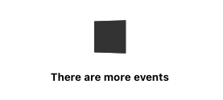

# Komodor skeleton

---

## #1 Bug fix: "Has more events" indication is broken.

**Current behavior:** The has more events indication always shows no more events with a static square.
\

**Expected behavior:** Show the loading square animation and loading more events text when there are more events.

**Focus:** The styling and functionality are already implemented but not wired to the API indication.

## #2 New feature: Add an infinite scroll to the Events page.

**Current behavior:** The page fetches only the first 20 events.

**Expected behavior:** When scrolling the page to the bottom more events should be loaded from the API until there are no more events.\

## #3 New feature: Add style to event by kind.

**Current behavior:** All events in the table look the same.

**Expected behavior:** Event row has style by the kind.
style:\

Instructions per event kind:
| | Color | image |
| ------------- |:-------------:|:-------------:|
| NodeFailure | #ff6464 | /src/utils/icons/error.png |
| HealthChange | #ffe162 | /src/utils/icons/change.png |
| PodRestart | #91c483 | /src/utils/icons/restart.png |

## #4 Bug fix: Navigation to event view broken.

**Current behavior:** Clicking on event navigates to ‘/:id’.

**Expected behavior:** Clicking on event navigates to the event view with the correct event id ‘/events/:id’.

## #5 New Page: Show event details.

**URL:** ‘/events/:id’
**Flow:**

- jobUID = Request to ‘POST: /jobs/:eventId’
- Try to pull data from ‘GET: /jobs/:jobId’ every 400 milliseconds.
- Show loading until there is data.
- When the result field is non-null, show the event data.
  **Style:**
  

## #6 Styling: Style event view page.

**Style:**

## #7 New features: Show the next 6 events.

**Expected behavior:** Show the next 6 events that clicking on them will show us the details of the clicked event.
**Impact:** The user will see the next 6 events, this allows for a quick navigation to another event.
**Style:**

